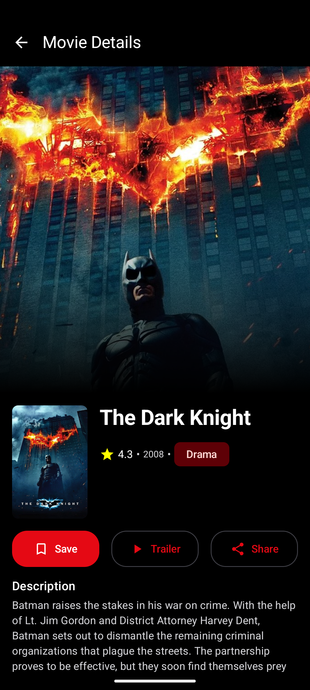
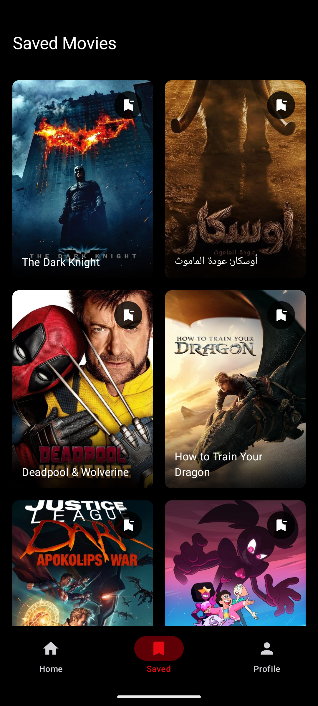

  <h1>Trailerly</h1>
  
<em>Discover movies. Watch trailers. Save favorites.</em>

  <table>
    <tr>
      <td align="center">
         
        <b>Home</b>
      </td>
      <td align="center">
         
        <b>Movie</b>
      </td>
      <td align="center">
         
        <b>Saved</b>
      </td>
    </tr>
  </table>

  <table>
    <tr>
      <td width="33%" style="border: 1px solid #ddd; padding: 10px; border-radius: 5px;">
        <h3>🎬 Discovery</h3>
        <ul>
          <li>Browse popular and trending movies</li>
          <li>Search for movies by title</li>
          <li>View detailed movie information and cast</li>
        </ul>
      </td>
      <td width="33%" style="border: 1px solid #ddd; padding: 10px; border-radius: 5px;">
        <h3>▶️ Trailers</h3>
        <ul>
          <li>Watch trailers directly in the app</li>
          <li>Stream high-quality video</li>
          <li>Share trailers with friends</li>
        </ul>
      </td>
      <td width="33%" style="border: 1px solid #ddd; padding: 10px; border-radius: 5px;">
        <h3>❤️ Favorites</h3>
        <ul>
          <li>Save and remove favorite movies</li>
          <li>Sync saved movies across devices</li>
          <li>Access your collection anywhere</li>
        </ul>
      </td>
    </tr>
    <tr>
      <td width="33%" style="border: 1px solid #ddd; padding: 10px; border-radius: 5px;">
        <h3>🌙 Experience</h3>
        <ul>
          <li>Dark mode with automatic system detection</li>
          <li>Material Design 3 interface</li>
          <li>Offline notifications</li>
        </ul>
      </td>
      <td width="33%" style="border: 1px solid #ddd; padding: 10px; border-radius: 5px;">
        <h3>🔐 Security</h3>
        <ul>
          <li>Google Sign-In protection</li>
          <li>Guest browsing option</li>
          <li>Secure account synchronization</li>
        </ul>
      </td>
      <td width="33%" style="border: 1px solid #ddd; padding: 10px; border-radius: 5px;">
        <h3>📱 Compatibility</h3>
        <ul>
          <li>Android 5.0+ support</li>
          <li>Responsive layout</li>
          <li>Cross-device functionality</li>
        </ul>
      </td>
    </tr>
  </table>

